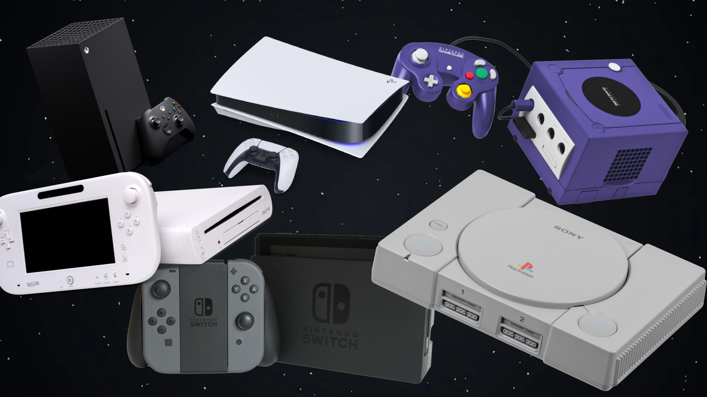

A következő data productot R nyelvben R notebookban írtam.Hasznos, hogy a kész notebook akár böngészőben is megnyitható, így könnyedén elérhető és bemutatható. Az elkészítés során a ChatGPT-t a különböző diagrammok paraméterezéséhez használtam a legtöbbet.

```{r}

```
A videojáték piac az egyik leggyorsabban növekvő és legdinamikusabb ágazatok közé tartozik, amely éves árbevétele a világon több mint 150 milliárd dollárt tesz ki. 
A videojátékok különböző platformokon, beleértve a számítógépeket, konzolokat, okostelefonokat és táblagépeket, elérhetőek. Ezek közül most a konzolok eladásait elemzem.

## adatok beolvasása, rendezése
  
Az első feladat az adatok beolvasása és sorba rendezése volt. Itt egy pár soros példán látható, hogy milyen információink vannak. Ezek a konzolok neve, típusa, a gyártó cég, a megjelenés és a piacról kivezetés éve, az eladott példányszám, megjegyzések, illetve az elemzésekhez, készítettem egy oszlopot amely az évtizedet tartalmazza, amelyben az adott konzol futott.
```{r}
df <- read.csv("best-selling game consoles.csv")
names(df)[6] <- 'Units.Sold'
df <- df[order(df$Units.Sold,decreasing = T ),]
df['decade'] <- sapply(df$Released.Year, function(x) x - x %% 10)
head(df)
```

```{r}
barplot(df$Units.Sold[c(1:20)], names.arg = df$Console.Name[c(1:20)], las=2, col = rainbow(60),
        main ='Videójáték konzol eladások\n(top 20)',
        ylab = 'Eladott példányszám(millió)')
```
Ezen az ábrán a top 20 eladással rendelkező konzol látható. Innen is könnyedén leolvasható, hogy a Playstation 2 mindenidők legtöbbet eladott konzolja, de a Nintendo DS sem marad el sokkal ettől. A 20. helyen található Playstation 5 egy nagyon szép eredmény úgy, hogy csak pár éve jelent meg ez a konzol.

## legtöbbet eladott konzol

```{r}
df[which(max(df$Units.Sold)== df$Units.Sold),]
```
## legkevesebbet eladott konzolok
A legtöbbet konzolt már említettem, de nézzük meg a lista végét is. Itt kb 1 milliós példányszémban elkelt konzolokból több is van.
Ezek jellemzően a 80-as és a 90es években bemutatott Atari, Philips konzolok.


```{r}
df[which(min(df$Units.Sold)== df$Units.Sold),]
```

```{r}
companies <- aggregate(df$Units.Sold, by=list(df$Company), FUN=sum)
companies <- companies[order(companies$x,decreasing = T), ]
names(companies)[1:2] <- c('companies', 'units_sold')
total_units <- sum(companies$units_sold)
companies['market_share'] <- sapply(companies$units_sold, function(x) round(x/total_units*100))
```

```{r}
barplot(companies$units_sold, names.arg = companies$companies, las = 2, col = 'blue',
        main = 'Konzol eladások cégenként összestve',
        ylab = 'Eladás(millió db)')
```
A konzol eladásokat cégenként összesítve jól látható, hogy a nintedo termékei kimagaslóan jól fogytak az évek során, utána következik a sony és a microsoft. ez talán nem is meglepő, ez a 3 cég akik a mai napig is gyártanak konzolokat, így a köztudatban is ezek a legismertebb cégek.
```{r}
pie(companies$market_share[1:6], companies$market_share,
    col = c('red', 'blue','green','lightblue', 'darkred','purple'),
    main = 'Piaci eloszlás százalékos arányban'
    )
legend("topright", legend = c(companies$companies[1:5],'egyéb'), 
       fill = c('red', 'blue','green','lightblue', 'darkred','purple'))
```
Itt százalékos arányban is látható a nintendo fölénye, majdnem a piac felét uralják, a Sony 32, míg a microsoft 10%- os piaci részesedéssel büszkélkedhet.A többi gyártó az 5%-ot sem éri el.
```{r}
par(mfrow=c(2,2))
barplot(df$Units.Sold[df$decade == 1990][1:5], names.arg = df$Console.Name[df$decade == 1990][1:5], las = 2, 
        main= '1990',
        col = c('blue','red', 'red','red', 'lightblue')
        ,ylab = 'Eladott példányszám(millió)')
barplot(df$Units.Sold[df$decade == 2000][1:5], names.arg = df$Console.Name[df$decade == 2000][1:5], las = 2, 
        main= '2000',
        col = c('blue','red','red','blue','green'))
barplot(df$Units.Sold[df$decade == 2010][1:5], names.arg = df$Console.Name[df$decade == 2010][1:5], las = 2, 
        main= '2010',
        col = c('red','blue','red','green','blue')
        ,ylab = 'Eladott példányszám(millió)')
barplot(df$Units.Sold[df$decade == 2020][1:2], names.arg = df$Console.Name[df$decade == 2020][1:2], las = 2,
        main= '2020',
        col = c('blue','green'))

```
Az utolsó ábrán évtizedenkénti bontásban hasonlíthatóak össze a konzol eladások. A 90-es években a playstation 1 vitte a prímet 100 millió feletti eladott példánnyal, de a Nintendo 3 különböző konzollal is bekerült a top 5-be ebben az időszakban.
A 2000-es években a Nintedno Ds és a Ps 2 eladásai nagyon hasonló számokat hoztak, kb 150 millió eladott példánnyal, de ebben az évtizedben már a microsoft is megjelent a top 5-ben az Xbox 360-al. 
A 2010-es évek is a Sony és a nintendo között döltek el, de itt a Nintendo Switch lett a befutó a ps4 elött.
A 2020-as években, azaz a mostani konzolgenerációban, már csak 2 versenyző jelenik meg, a ps5 és az xbox series x és series s. Bár a nintedo switchet is ide lehetne még sorolni, mert még mindig forgalomban van, nem lenne fair az összehasonlítás mivel az már 2017 óta kapható.
